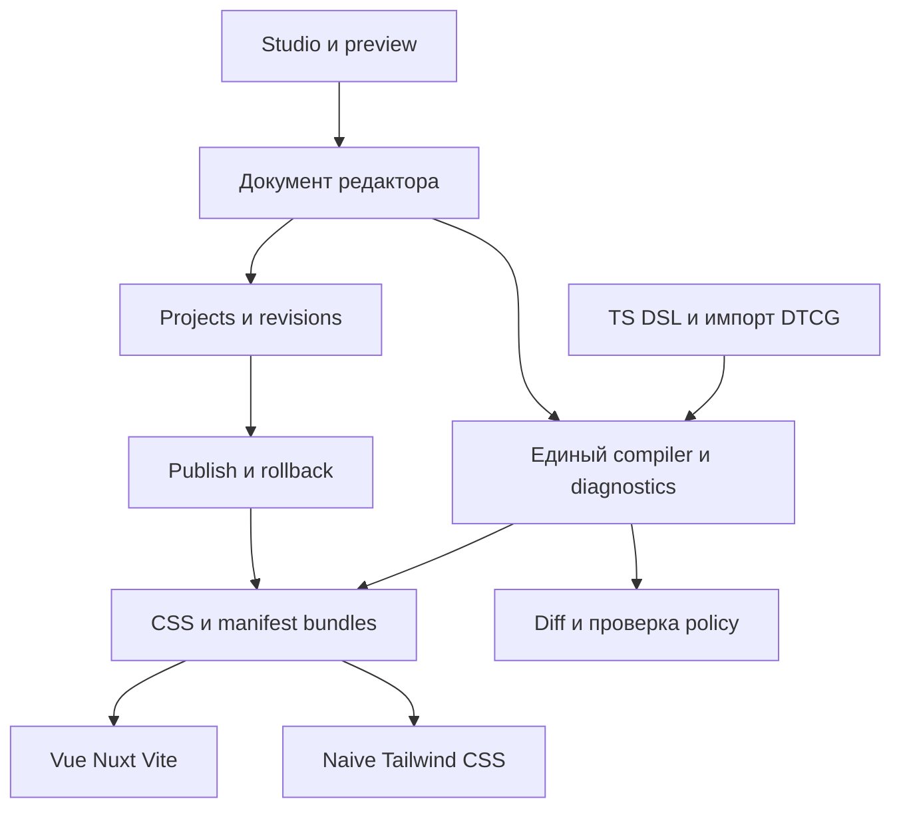

# Полный аудит ThemeOn и план развития продукта

ThemeOn имеет сильную основу: девять пакетов с понятными границами, core без runtime dependencies, типизированный DSL, компилятор, CSS foundation и работающие интеграции. Следующий этап — исправить нарушения контрактов, сделать установку и выпуск надёжными и развивать редактор и сервис поверх одного движка.

До публичного запуска остаются существенные проблемы. Подтверждены зависающие Promise в HMR, разный CSS при одинаковом fingerprint, изменяемые вложенные данные, потеря DTCG metadata и пробелы в релизных проверках. Dependency audit вернул 80 записей advisory. Редактор и серверная платформа пока отсутствуют; их создание составляет отдельную часть продуктового плана.

## Основание и границы аудита

- Дата: 8 октября 2026 года.
- Код: `main`, `7588ba6d77118fc777e544a2f5ce1e32bdc41959`.
- Локальные проверки: Linux x64, Node `24.12.0`, pnpm `11.10.0`.
- Объём: все девять публикуемых пакетов, playground, API/manifests, compiler/runtime/tenant boundaries, DTCG, accessibility checks, тестовая инфраструктура, performance, CI/release, документация и путь нового пользователя.
- Рабочая копия уже содержала изменения конфигурации агентов и `.gitignore`. Они сохранены; их влияние отделено от отслеживаемого кода.
- Изменения этого аудита: отчёт и материалы в `audits/2026-10-08-evidence/`. Код продукта, lockfile и внешние настройки не менялись. Коммит, релиз и публикация не выполнялись.

Это аудит контрактов и сценариев отказа с воспроизведениями. Он не доказывает отсутствие всех ошибок, не заменяет исчерпывающий анализ каждого коммита или новое сканирование всей истории на секреты. Внешние приложения потребителей не проверялись. Серверной платформы для проверки пользовательского доступа, изоляции и хранения данных в этом репозитории пока нет.

## Готовность по направлениям

| Направление | Состояние | Что мешает следующему этапу |
|---|---|---|
| Движок токенов | Работает, требует исправления контрактов | Fingerprint, immutability, errors extensions |
| Vue и Nuxt | Основные сценарии проверены | Lifecycle, восстановление после ошибок, полный SSR/CSP contract |
| Vite и HMR | Основные сценарии проверены | Debounce при быстрых повторных обновлениях |
| CSS и Tailwind | Интеграции проверены | Уточнение ограничений и каталог примеров |
| Naive UI | Adapter conformance проверен | Матрица состояний и контраста всех поддерживаемых roles |
| DTCG interchange | Ограниченное подмножество | Публичное сохранение metadata, диагностика потерь |
| Публичная библиотека | До первого релиза | Все npm endpoints возвращают 404, docs сайт недоступен |
| Основа собственных проектов | Подходит для пилотов после исправлений P1 | Повторяемая миграция и реальный consumer feedback |
| Визуальный редактор | Не реализован | Редактирование, preview, история, import/export |
| Серверная платформа | Не реализована | Projects, revisions, доступ, публикация, rollback, эксплуатация |

## Результаты проверок

| Проверка | Результат | Ограничение |
|---|---|---|
| `pnpm build` | Все 9 пакетов прошли | Локальный checkout; чистую сборку дополнительно подтверждает CI |
| `pnpm typecheck` | Прошёл | После build, на Node 24 |
| `pnpm test:coverage` | 1589 passed, 1 skipped | Процент относится к выбранным критическим исходникам |
| Coverage | Statements 84,18%; lines 84,92%; branches 74,52% | У 12 файлов проверяется отсутствие регрессии относительно baseline |
| Lint исходников проекта | Прошёл | `pnpm exec oxlint packages apps tests scripts benchmarks docs` |
| Общий `pnpm lint` | Не прошёл | Ошибки в локальных snippets неотслеживаемой `.agents/` |
| Fast и Chromium integration | 66 passed, 1 skipped | Пропуск — отдельный cross-browser smoke |
| Nuxt E2E | 3 passed | Dev/HMR и CLI init существующей suite |
| Packed consumers | 10 passed | 8 cells и self-checks, включая Nuxt production build |
| Packed types | 7 passed | 6 cells и self-check, включая TypeScript 5.4.5 |
| Internal Stylelint kit | 5 passed | Внутренний набор, публичного Stylelint пакета нет |
| Firefox smoke | 1 passed | Короткий compiled-contract smoke |
| WebKit smoke | 1 passed | Использована временно распакованная `libwoff1`, без системной установки |
| `pnpm check:pack` | Прошёл | ATTW использует `--entrypoints .`; subpaths дополнительно проверяют fixtures типов |
| API reports | 9 пакетов прошли | `check-api-report.mjs` и self-check |
| Architecture docs | Прошли | Инвентарь и структурные требования; не истинность каждой фразы |
| `pnpm docs:build` | Прошёл | Не проверяет выполнение примеров и доступность сайта |
| `pnpm test:mutation` | Прошёл | 1096 mutants, covered MSI 73,03%, floor 69,5% |
| Mutation детали | 695 killed, 17 timeout, 263 survived, 121 no coverage | Общий score 64,96%; survivors требуют содержательного разбора |
| Performance | 8 сценариев в бюджете +30% | Сравнение с `4604eda` на одной машине и текущем harness |
| Dependency audit | 80 записей advisory | 5 critical, 41 high, 30 moderate, 4 low; upstream severity не равна доказанному exploit ThemeOn |

Первая browser-проверка упала из-за отсутствующего Chromium; после подготовки окружения suite прошла. Временные ошибки чтения `dist` во время одновременной пересборки self-check исключены из продуктовых выводов; browser checks повторены после сборки. Временный checkout и браузеры, загруженные для аудита, удалены после сохранения результатов: на машине закончилось свободное место. Для повторного запуска browsers используется стандартный `playwright install`.

Текущий публичный [CI на проверенном коммите](https://github.com/axiomasoft/themeon/actions/runs/37506474903) успешен. [Release workflow](https://github.com/axiomasoft/themeon/actions/runs/37506474923) также зелёный, но пакеты не опубликованы. [Browser workflow от 7 октября](https://github.com/axiomasoft/themeon/actions/runs/37622916223) зелёный. Ошибки старых Performance и Mutation runs на `4604eda` не перенесены на текущий код без проверки.

## Что сохранить в архитектуре

1. **Границы пакетов.** Core, colors, CSS, доставка, runtime, adapters и CLI решают разные задачи.
2. **Core без runtime dependencies.** Цветовой движок остаётся самостоятельным дополнением.
3. **Subpath API и единая module identity.** Authoring/compiler/runtime/DTCG/tenant имеют явные фасады и проверки exports.
4. **Compiler instance вместо глобального registry.** Нужно исправить snapshots и errors, сохранив scoped extensions и cache contributions.
5. **Tenant boundary.** Bounds, positive grammar, trust policies и parity с JSON Schema — хорошая основа сервиса.
6. **Раздельные WCAG и APCA каналы.** В коде `pass` нормативный, `apcaPass` advisory; public descriptions должны соответствовать.
7. **Проверки реальных consumers.** Tarballs, integrations, property laws, mutation и self-checks уже полезны.
8. **Trigger-gated roadmap.** Редактор и сервис получают явный приоритет; дополнительные adapters выбирать по настоящим integrations.

Полная перепись или немедленное дробление core не устраняет обнаруженные дефекты. Сначала нужно исправить существующие контракты и провести изменения через consumer suites.

## Приоритеты находок

P1 — существенная проблема до соответствующего публичного использования. P2 — ограниченный дефект или планируемое улучшение. P3 — небольшая проблема demo. Оценки предварительные: исправление с проверками, без разработки новых продуктовых модулей.

| ID | Приоритет | Область | Проблема | Оценка |
|---|---|---|---|---|
| F01 | P1 | Dependencies | Известные уязвимости установленного графа | 2–5 дней обновления и triage |
| F02 | P1 | Vite | Debounce оставляет ранние Promise pending | До 1 дня |
| F03 | P1 | Compiler | Один fingerprint соответствует разному CSS | 1–2 дня |
| F04 | P1 | Core | Вложенные patches и compiled tokens изменяемы | 1–3 дня |
| F05 | P1 | DTCG | Public path теряет description и deprecated | 3–7 дней |
| F06 | P1 | Extensions | Error diagnostics не определяют отказ emit | 1–3 дня после выбора policy |
| F07 | P1 | Release | Защитные правила release и main отсутствуют | До 1 дня настройки |
| F08 | P1 | CI | Packed consumer matrix не запускается автоматически | 1–2 дня |
| F09 | P1 | Product DX | Install и опубликованные docs недоступны | 2–4 дня без внешнего publish |
| F10 | P2 | CLI | Повторная загрузка config возвращает старую тему | 1–2 дня |
| F11 | P2 | CLI | Валидный CSS и comments дают ложные errors | 2–4 дня |
| F12 | P2 | Vue | Ошибка оставляет глобальное отключение transitions | До 1 дня |
| F13 | P2 | Vue | Нет cleanup media listener | 1–2 дня |
| F14 | P2 | Accessibility | Pass при отсутствии проверенных pairs | 1–3 дня |
| F15 | P2 | Naming | Alias на своё имя создаёт CSS cycle | До 1 дня |
| F16 | P2 | Core | Тема `__proto__` исчезает при resolution | До 1 дня |
| F17 | P2 | Architecture | Build channels используют разные compiler paths | 2–4 дня |
| F18 | P2 | Verification | Verify расходится с CI, важные сценарии вне gates | 1–3 дня |
| F19 | P2 | Environment | Lint читает локальные agent snippets | До 1 дня |
| F20 | P2 | Supply chain | Docs actions не pinned к SHA | До 1 дня |
| F21 | P3 | Playground | Вложенный body и неработающий anchor | До 1 дня |

## Подтверждённые дефекты и пробелы

### F01 Уязвимости зависимостей

**Тип:** dependency. **Доказательство:** `pnpm audit --json`, [сводка advisory](./2026-10-08-evidence/dependencies.json), `pnpm-workspace.yaml`, `pnpm-lock.yaml`, `apps/playground/nuxt.config.ts:3`.

Установлены Nuxt `4.4.8`, `@nuxt/devtools` `3.2.4`, Vue renderer `3.5.39`. Critical findings относятся к DevTools, simple-git, argv-parser, seroval и shell-quote. Среди high — Nuxt runtime/islands, Vue SSR и транзитивные parser/build dependencies.

DevTools включён в playground. [Nuxt DevTools advisory](https://github.com/advisories/GHSA-279x-mwfv-vcqv) описывает выполнение команды через доступный HMR RPC в development mode; исправление начинается с `3.3.1`. Это риск разработки, а не доказанный exploit опубликованного core. [Nuxt island advisory](https://github.com/advisories/GHSA-9473-5f9j-94wq) и [Vue SSR advisory](https://github.com/advisories/GHSA-g2v6-rqmx-r4w6) требуют отдельной оценки достижимости.

**Доработка:** обновить прямые и совместимые транзитивные dependencies, разобрать остаток по достижимым paths. Исключения фиксировать с причиной и сроком. Проверять зафиксированный lockfile регулярно: dependency-review на PR не заменяет такую проверку.

**Критерий:** нет необъяснённых critical/high на достижимых путях, consumer suites проходят. Nuxt присутствует в playground/dev/consumer graph и является peer модуля; список advisory нельзя объявлять обязательными runtime dependencies каждого tarball.

### F02 Debounce оставляет первое обновление pending

**Тип:** code. **Где:** `packages/vite/src/debounce.ts:10`, `packages/vite/src/index.ts:149`.

Новый вызов отменяет предыдущий timer и создаёт новый Promise. Resolve/reject предыдущего Promise теряются. Два вызова до истечения интервала дают `firstSettled: false`, `secondSettled: true`, `fnCalls: 1`.

**Влияние:** `hotUpdate`, ожидающий первый вызов, остаётся pending при burst изменений. Обычный browser HMR test проходит.

**Доработка:** общий Promise для trailing execution или завершение всех накопленных callers его результатом. Определить поведение вызова во время уже выполняющейся compilation.

**Критерий:** все callers завершаются последним результатом либо error; обновление после ошибки работает.

### F03 Options изменяют CSS после фиксации fingerprint context

**Тип:** code. **Где:** `packages/core/src/pipeline/compile.ts:108`, `:143`.

`context.resolve` копируется и замораживается, а resolver читает исходный `options.resolve`. Изменение `prefix` с `one` на `two` даёт разные names/CSS и прежний fingerprint; context остаётся `prefix: one`.

**Влияние:** идентичность артефакта больше не гарантирует его содержимое; cache и revision identity получают некорректную основу.

**Доработка:** normalized immutable snapshot options используется одновременно при resolution и fingerprint. Проверить сохранённые extension descriptors.

**Критерий:** mutation исходных options не меняет созданный compiler; новый compiler отражает новые options в fingerprint.

### F04 Immutability не распространяется на вложенные данные

**Тип:** code. **Где:** `packages/core/src/define.ts:323`, `packages/core/src/pipeline/compile.ts:56`, `packages/core/src/model/build.ts:5`; контракт — `docs/adr/ir-immutability.md`.

`defineTheme` сохраняет вложенные patch objects: изменение исходного `patch.color.text` меняет последующую compilation. `freezeResolved` фиксирует arrays/maps, сохраняя изменяемые `ResolvedToken`: mutation `resolved.themes.dark[0].value` меняет повторную serialization, а `result.css` остаётся старым. Глубину nested metadata extensions также нужно проверить.

**Влияние:** editor, cache и plugins получают несогласованные snapshots. Readonly аннотация не защищает от mutation исходного объекта владельцем.

**Доработка:** независимые snapshots и фиксация поддерживаемых nested values на owning boundary; без побочного замораживания чужого input.

**Критерий:** исходный config не меняет definition после authoring; CSS/document/resolved/fingerprint относятся к одному snapshot.

### F05 Public DTCG path теряет metadata без diagnostics

**Тип:** architectural. **Где:** `packages/core/src/dtcg/from-dtcg.ts:244`, `:580`, `packages/core/src/authoring/normalize-dtcg.ts:22`, `packages/core/src/dtcg/to-dtcg.ts`.

Документ с `$description` и `$deprecated` проходит public `fromDTCG` без diagnostics. `compileTheme(imported.definition)` получает пустую metadata. `toDTCG` также не сохраняет обе характеристики и не сообщает о потере.

Private `normalizeDtcg` умеет извлечь metadata, но public compiler принимает definition и запускает DSL normalization. Тест private normalizer не доказывает public round trip. Support matrix честно отмечает gap; architecture claims о preservation нужно ограничить реально доступным путём.

**Влияние:** descriptions и deprecations исчезают при interchange, что мешает Studio и migrations.

**Доработка:** public metadata-preserving import/compile/export contract. До него — явная loss diagnostic и согласованный strict/lossy policy.

**Критерий:** public round trip сохраняет поддерживаемые данные; unsupported loss требует явного выбора. Полная conformance должна подтверждаться требованиями [DTCG 2025.10](https://www.designtokens.org/tr/2025.10/format/), Community Group specification, которая не является W3C Standard.

### F06 Error validator не останавливает emit

**Тип:** architectural. **Где:** `packages/core/src/pipeline/compile.ts:126`.

Validator `validate-output` возвращает diagnostic с `severity: error`, а compiler всё равно выдаёт CSS. `CompileResult` не содержит success discriminator. Это относится к user validators; встроенные graph failures и CSS guards продолжают бросать exceptions.

**Влияние:** каждому consumer нужна отдельная проверка diagnostics, а публикация результата не имеет однозначного success contract.

**Доработка:** default отказ emit на error либо явно различимые success/failure results. Partial output, если нужен Studio, должен иметь явный режим.

**Критерий:** error validator исключает штатную публикацию, warning допускает успех, diagnostics сохраняются при отказе.

### F07 Защита релиза не настроена

**Тип:** process. **Где:** `.github/workflows/release.yml`, `docs/architecture/release-security.md`.

GitHub API показывает у `release` пустой `protection_rules`, `deployment_branch_policy: null`. У `main` нет classic branch protection; effective rules endpoint возвращает `[]`, repository rulesets пуст. Это расходится с описанной owner-controlled границей релиза.

**Доработка:** настроить предусмотренные protections и минимальные required checks, определить bootstrap первого npm publish и подтвердить trusted publisher. Зелёный pre-publish job не доказывает OIDC/provenance. Token fallback снимать после доказанного перехода согласно [npm guidance](https://docs.npmjs.com/trusted-publishers/).

**Критерий:** фактические settings совпадают с policy; публикуется разрешённая revision; реальный artifact подтверждает provenance. Аудит settings не менял.

### F08 Packed consumers отсутствуют в automatic release verification

**Тип:** test. **Где:** `.github/workflows/verify.yml:64`, `.github/workflows/ci.yml`, `tests/consumers/matrix.manifest.json`.

`test:consumers` не вызывается workflows, хотя suite существует и проходит. Packed types и package hygiene не заменяют внешний Nuxt production build, Vite build и Tailwind compilation из tarballs.

**Влияние:** defect, обнаруживаемый готовой consumer suite, может пройти release.

**Доработка:** обязательная consumer lane релиза; подходящий subset на PR. Docs build также проверять до merge, а не только при deployment.

**Критерий:** найденная consumer matrix ошибка блокирует релиз. Локальный полный consumers run занял около 133 секунд.

### F09 Install и документация не готовы к первому внешнему пользователю

**Тип:** process/product gap. **Где:** `README.md`, `docs/.vitepress/config.ts`, `docs/basic-usage/cli.md:18`, `docs/introduction/quick-start.md:17`, `.github/workflows/docs.yml:59`.

Все девять npm endpoints на 8 октября возвращают 404, что соответствует pre-release. Однако «install from git» не объясняет установку отдельных packages из private monorepo root и внутренних dependencies. До release нужен проверенный tarball/workspace рецепт.

Дополнительно:

- CLI Basic Usage предлагает `npm i -D themeon`, manifest — `@themeon/cli`; Installation page уже исправлена.
- Vue quick start показывает `theme.config.ts`, CLI default читает `theme/theme.config.ts`; `const theme` не экспортируется.
- Vue snippet не показывает import generated CSS и полностью работающее приложение.
- Root README описывает Tailwind `@theme inline`, текущая реализация — `@theme reference`.
- Несколько public descriptions говорят о трёх CLI командах и APCA gate, хотя CLI расширен и нормативный gate использует WCAG.
- Changelog вручную фиксирует 15 changesets и уже отстаёт от каталога.

Docs URL старой и текущей organizations возвращают 404. [Docs run](https://github.com/axiomasoft/themeon/actions/runs/37506474466) собрал сайт, но deploy упал с `Failed to create deployment (status: 404)` и указанием включить Pages. Pages API также возвращает 404. Старые GitHub repository links при этом перенаправляются на текущий repository и не являются полностью неработающими.

**Доработка:** runnable quick start на каждую среду, правильные paths/exports/installs, актуальные descriptions, восстановление Pages и canonical URLs. Проверять snippets как consumer fixtures.

**Критерий:** чистый внешний проект получает light/dark тему по инструкции; сайт отвечает 200 и соответствует release.

### F10 CLI кеширует старый config в долгоживущем процессе

**Тип:** code. **Где:** `packages/cli/src/load-theme.ts:19`, `:36`.

Module-level jiti использует cache defaults. Изменение TS file между двумя loads не отражается во втором результате; возвращается тот же instance.

**Влияние:** отдельные process invocations свежие, programmatic `runBuild`/`runCheck` в watch/editor могут читать старый input.

**Доработка:** fresh-load policy config и imported tokens с сохранением module identity core; использовать опыт Nuxt loader.

**Критерий:** повторный вызов читает изменённый config и dependency.

### F11 Coverage scanner даёт ложные error findings

**Тип:** code. **Где:** `packages/cli/src/checks/coverage.ts:19`, `:41`.

Regex сканирует весь raw file. Comment `/* example: var(--removed-example) */` даёт error; реально объявленное локальное `--card-gap` тоже считается dead reference. Raw `.vue` script/comments также попадают в hardcode scan, хотя его warnings менее разрушительны.

**Влияние:** корректные styles блокируют `themeon check`, создавая необходимость отключать gate или расширять allowlist.

**Доработка:** CSS/value parsing и Vue style blocks, local definitions, явный scope ThemeOn variables и suppressions с причиной. Сначала проверить reuse parsers внутреннего Stylelint kit.

**Критерий:** comments и local vars не дают error, настоящая missing token reference обнаруживается с location.

### F12 Ошибка применения оставляет глобальный style

**Тип:** code. **Где:** `packages/vue/src/state.ts:39`.

`withoutTransition` добавляет `transition:none !important`, вызывает `write()` и потом планирует cleanup. Exception из supported target seam не даёт выполнить cleanup. Два failed init оставляют два styles.

**Влияние:** transitions остаются выключены для всей страницы.

**Доработка:** guaranteed cleanup при failure с сохранением двухкадровой successful semantics.

**Критерий:** оба пути удаляют временный style, retry не накапливает elements.

### F13 Media listener не освобождается

**Тип:** architectural. **Где:** `packages/vue/src/state.ts:234`, `packages/vue/src/plugin.ts`.

Anonymous listener создаётся в init; API не имеет disposal, plugin не регистрирует lifecycle cleanup.

**Влияние:** app remount и isolated Studio previews могут оставлять old state/target живыми. Одна обычная SPA менее подвержена этому сценарию.

**Доработка:** сохранённый callback, lifecycle cleanup и определённая semantics init после disposal.

**Критерий:** unmount прекращает changes старого target, новый instance независим, SSR не создаёт client listeners.

### F14 Contrast pass не сообщает полноту проверки

**Тип:** test/product policy. **Где:** `packages/colors/src/contrast.ts:187`, `:232`, `:261`.

Отсутствующие roles намеренно пропускаются. Lookup только с `on-warning`/`action-warning` возвращает `pass: true`, empty reports и не проверяет одинаковые fg/bg. Это ограничение partial-theme contract, а не ошибка WCAG formula.

**Влияние:** pass можно ошибочно принять за доступность всей темы. 14 pairs не охватывают все status/disabled/interaction roles и реальные backgrounds.

**Доработка:** coverage проверки, различимое «ничего не проверено», required pairs для публикации full theme; мягкий режим partial theme явно обозначить. Расширить pairs по поддерживаемым adapter states.

**Критерий:** CLI/UI различают pass и полноту, empty report не становится знаком «accessible». На previews отдельно проверять focus/keyboard/motion/forced colors/zoom.

### F15 Alias на собственное имя создаёт CSS cycle

**Тип:** code. **Где:** `packages/core/src/resolve.ts:145`, `:305`.

Custom rule возвращает имя token, проходит claim с тем же owner path и перезаписывает value на `var(--color-text)`. Исходное значение теряется.

**Доработка:** identity alias как no-op либо explicit rejection.

**Критерий:** self-reference не генерируется, legacy-v0 parity сохранена.

### F16 Имя темы proto исчезает в output maps

**Тип:** code. **Где:** `packages/core/src/resolve.ts:281`, `packages/core/src/pipeline/compile.ts:57`, `packages/core/src/model/build.ts:52`.

Own key `__proto__` из JSON принимается definition, но присваивание в обычный dictionary object меняет его prototype вместо own property. Resolved theme и CSS блок отсутствуют.

**Влияние:** bounded name-handling defect. Воспроизведение не изменяет глобальный `Object.prototype` и не доказывает глобальный pollution exploit.

**Доработка:** единая name policy или dictionaries без prototype на всех стадиях.

**Критерий:** имя явно отвергается либо проходит без потери темы.

### F17 Build channels используют разные compiler entrypoints

**Тип:** architectural debt. **Где:** `packages/vite/src/index.ts:70`, `packages/nuxt/src/module.ts:104`, `packages/cli/src/commands/build.ts:56`, `packages/cli/src/query/context.ts`.

Vite использует `compileTheme`; Nuxt и основной CLI build — resolver плюс serializer; query tooling отдельно строит IR/graph. Staged pipeline строит graph, compatibility resolver повторяет работу.

**Влияние:** новая metadata/diagnostics/policy требует нескольких изменений и не гарантированно доходит до каждого канала. Performance сейчас остаётся в бюджете.

**Доработка:** после F03–F06 единый owning compiler path и проверенный compatibility facade. Graph optimization — по профилированию.

**Триггер:** metadata-preserving public import, Studio или новая compiler policy. **Критерий:** CSS parity и diagnostics одинаковы на всех delivery channels.

### F18 Verification не охватывает часть актуальных контрактов

**Тип:** test/process. **Где:** `package.json:28`, `.github/workflows/verify.yml`, critical coverage/mutation include lists.

Local verify не включает API reports, architecture docs и packed types, имеющиеся в CI. Docs build не входит в PR verification. Gates не охватывают новый CSS safety tokenizer, compiler lifecycle и debounce; выполненные tests не обнаружили воспроизведённые дефекты.

DTCG import имеет 67,19% branches, WCAG — 53,48%, CLI check — 32%. Mutation оставляет 263 survivors и 121 no-coverage mutant. Это направления анализа; каждый surviving mutant не обязательно является bug.

**Доработка:** синхронизировать проверяемые contracts, убрать redundant build, добавить конкретные failure scenarios и triage survivors policies/graph/diagnostics. Включить заявленные critical boundaries в измеряемый набор.

**Критерий:** повторное внесение обнаруженного дефекта ломает соответствующую fixture; coverage растёт по рискованным сценариям без произвольного общего процента.

### F19 Local agent snippets ломают общий lint

**Тип:** environment/process. **Где:** `.oxlintrc.json`, `.agents/plugins/bundles/` рабочей копии.

Oxlint падает на duplicate `expect` и unused parameters в snippets; scoped project lint проходит. `.agents/` был untracked до аудита, это не регрессия публичного CI.

**Доработка:** product lint scope и исключение machine-local/generated snippets по принятой agent-file policy.

**Критерий:** инструменты окружения не делают стандартную проверку красной; correctness errors source по-прежнему блокируются.

### F20 Docs actions расходятся с SHA pinning policy

**Тип:** dependency/process. **Где:** `.github/workflows/docs.yml`; контракт — `docs/architecture/release-security.md`.

Docs uses mutable `@v4`, основные workflows pinned к SHA. Workflow имеет Pages/OIDC permissions.

**Доработка:** pinned actions и необходимые permissions по обязанностям build/deploy jobs.

**Критерий:** воспроизводимые workflow dependencies, Pages работает. Это не доказательство compromise.

### F21 Playground имеет небольшие HTML и navigation дефекты

**Тип:** code/product presentation. **Где:** `apps/playground/app.vue:9`, `:13`.

Template содержит body внутри Nuxt app container; ссылка `#foundation` не имеет target id. Playground выполняет smoke-задачу, но не показывает весь продукт.

**Доработка:** корректный root markup и anchors; в продуктовой фазе — каталог colors/Naive/Tailwind/tenant/interchange примеров.

**Критерий:** valid structure, working navigation и понятные основные сценарии.

## План продукта в полном объёме

Полный объём состоит из библиотеки, Studio и сервиса управления темами. У них общие данные и compiler semantics, собственные responsibility boundaries и поставляемые промежуточные версии.

Это предлагаемая структура, а не уже принятый ADR. Studio, persistence и server contracts предстоит спроектировать.

### Этап 1 Исправить основу и выпустить библиотеку

Закрыть F01–F09, сразу помещая failure scenarios в owning suites. Переснимать API reports при сознательном изменении contract, затем выровнять local verification, docs и release protections.

Поставка этапа:

- Исправленные HMR, snapshots/fingerprint и validation policy.
- Public DTCG contract с metadata preservation или explicit loss diagnostic.
- Проверенный install каждого пакета; первая npm версия после scope/publishing preparation.
- Рабочие docs и четыре runnable starters: Vue/Vite, Nuxt SSR, Laravel/Vite, vanilla/CSS.
- Матрица Node/TS/Vue/Nuxt/Vite/Tailwind/browser support. Реальные Node requirements tooling отразить в публичных manifests: root engines не наследуется tarball consumers.
- API stability policy, release/migration notes и канал сообщения security issue.

**Готовность:** внешний consumer повторяет setup; packed matrix обязательна при релизе; changes не скрывают контрактных потерь. Ориентир — 3–5 недель одного опытного инженера с первой стабилизацией; оценка не является обещанием срока.

### Этап 2 Довести библиотеку до опоры для дизайн систем

Закрыть F10–F20, провести реальные миграции двух разных приложений — SSR и CSS/Vite. Собирать наблюдаемые трудности authoring, доставки, диагностики и updates.

Поставка:

- Один build compiler path и parity compatibility API.
- Явные base/theme/scheme/scope/runtime patch правила.
- Structured diagnostics с token path, source location, severity и исправлением.
- Матрица поддерживаемых adapter states: hover/pressed/disabled/focus/status.
- Contrast coverage и indeterminate cases; APCA отдельно от normative policy.
- Lifecycle cleanup, SSR isolation, CSP hash/nonce и первый paint.
- Legacy migrations, semantic diff и безопасные dry-run hints.
- Catalog defaults/presets из настоящих consumer scenarios.

**Готовность:** пилоты обновляются через documented path, outputs воспроизводимы, major API changes принимаются сознательно. Ориентир — ещё 3–6 недель с учётом обратной связи и объёма migrations.

### Этап 3 Создать Studio

Studio решает полный workflow: найти token, изменить value/reference, увидеть влияние в компонентах, проверить и сохранить revision.

| Возможность | Необходимое поведение |
|---|---|
| Explorer | Поиск, groups, type/value/metadata, references и dependent tokens |
| Editing | Typed controls, alias picker, validation, undo/redo |
| Themes | Base, light/dark/custom variants, schemes по принятому contract |
| Palettes | Seed, generated scale, explicit overrides и понятное происхождение |
| Preview | Реальные CSS/Naive/Tailwind components, responsive sizes и states |
| Accessibility | Checked pairs, missing roles, indeterminate, keyboard/focus/motion |
| Interchange | DTCG import с supported subset и потерями до подтверждения, export CSS/docs |
| Comparison | Revision diff и влияние breaking changes на dependencies/components |
| Persistence | Save/reload/recovery, версия формата, отсутствие потери работы |
| Diagnostics | Общий report UI/CLI, без отдельной реализации resolver |

До реализации определить versioned serializable document для tokens/references/metadata/variants. TS expressions выполняются в доверенном локальном authoring; данные пользовательского сервиса требуют ограниченного формата. IR остаётся compiler representation, persistence получает собственные versioning/migrations.

Preview изолируется iframe; большие browser compilations выполняются в worker. Сразу определить источник истины — пользовательский файл либо project revision — и обработку конфликтов синхронизации.

**Готовность:** автор создаёт и экспортирует тему, видит errors до publish, undo/redo и reload сохраняют работу. Ориентир — 6–10 недель качественного первого Studio, больше при развитом visual editing и полной interchange поддержке.

### Этап 4 Добавить сервис проектов и публикации

Сервис создаёт trust boundaries, которые библиотека не реализует. Их проектируют до открытия API.

| Область | Контракт |
|---|---|
| Access | User/workspace/project, роли и edit/publish permissions |
| Storage | Immutable revisions, drafts, metadata, migrations |
| Collaboration | Version check при сохранении, conflicts и change history |
| Compilation | Bounded JSON, quotas, timeout, изолированные jobs, compiler version |
| Publishing | Только проверенная revision, immutable bundle/hash, atomic activation |
| Delivery | Public/private artifacts, access и cache policy |
| Rollback | Возврат опубликованной revision без повторного выполнения config |
| API | Versioning, structured errors, idempotency и automation scopes |
| Isolation | Project/tenant validation на каждом storage/artifact path |
| Operations | Backup/restore, job visibility, metrics и проверенное восстановление |

Jiti loader выполняет доверенный local TS config. Server input проходит ограниченный document format; такой loader нельзя прямо превратить в upload endpoint.

Compilation становится job, результат — сохранённый bundle. Доставка читает готовые artifacts. Preview/draft validation/publish используют одну compiler version и policy; preview не публикует автоматически.

**Готовность:** failed job и save conflict не теряют revision; isolation проверена; publish/rollback воспроизводимы; backup restore работает. Ориентир — 8–14 недель после фиксации Studio/API/storage contracts.

### Этап 5 Развивать integrations и поддержку

Добавлять нужные design-tool connectors, migrations, verified presets и team automation после работающего общего workflow. Для Figma/Tokens Studio явно определить supported types/modes/aliases и проверить round trip. Обещание «любые tokens без потерь» текущему subset не соответствует.

Коммерческие возможности выбирать вокруг shared workspaces, revision history, controlled publishing, private presets и automation. Оплату, лимиты и vendor choices нельзя обосновать одним code audit: нужны реальные пользовательские сценарии и feedback.

Позиционирование стоит показывать действием: одна типизированная тема управляет CSS, runtime и поддерживаемыми UI adapters. [Style Dictionary](https://styledictionary.com/info/architecture/) уже имеет зрелый transformation pipeline, поэтому compiler architecture сама по себе не доказывает market uniqueness. Landing claim о полном отсутствии конкурентов заменить проверяемыми comparisons workflows.

## Условия качественного продукта

ThemeOn должен сохранять один смысл темы при authoring, interchange, preview, build и runtime. Ошибка не превращается в тихую потерю данных; artifact относится к определённой revision/compiler version; новый пользователь повторяет setup без знания монорепозитория.

Для полного объёма ориентир одного инженера — примерно 5–9 месяцев, плюс время на UX, feedback и поддержку. Команда может параллелить этапы после определения границ. Каждый слой должен иметь самостоятельную проверяемую поставку.

## Материалы воспроизведения

- [12 сценариев и фактические результаты](./2026-10-08-evidence/probes.json).
- [Скрипт воспроизведения](./2026-10-08-evidence/reproduce.mjs): после install/build выполнить `node audits/2026-10-08-evidence/reproduce.mjs`. Exit 0 показывает выполнение probes, а не корректность продукта.
- [Проверки и внешние статусы](./2026-10-08-evidence/verification.json).
- [80 advisory records](./2026-10-08-evidence/dependencies.json).
- [Performance candidate](./2026-10-08-evidence/performance-candidate.json) и [reference](./2026-10-08-evidence/performance-reference.json).

Ближайший порядок работы: dependencies и HMR; compiler snapshots/fingerprint/errors; DTCG preservation; release/consumer gates; install/docs publication. Затем lifecycle/scanner/accessibility и Studio поверх общего исправленного контракта.
