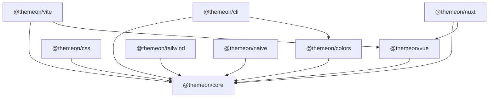

# Package graph

Workspace layout (`pnpm-workspace.yaml`): `packages/*`, `apps/*`, `tests/*`.

## Roles

| Package | Depends on | Delivers |
|:--|:--|:--|
| `@themeon/core` | — | IR, compiler, diagnostics, tenant, DTCG |
| `@themeon/colors` | core | OKLCH scales, WCAG 2.2 + APCA advisory |
| `@themeon/css` | core | Layered CSS foundation |
| `@themeon/vue` | core | `useTheme`, anti-FOUC script |
| `@themeon/vite` | core, vue | Virtual CSS module, manifest/CSP artifacts |
| `@themeon/nuxt` | core, vue | Nuxt module + codegen |
| `@themeon/cli` | core, colors | `themeon` binary |
| `@themeon/tailwind` | core | Tailwind v4 `@theme inline` bridge |
| `@themeon/naive` | core | Naive UI overrides |

Verification workspaces (`tests/integration`, `tests/consumers`, `tests/types`, `tests/stylelint-internal`) depend on built packages via packed tarballs or workspace links; they are not published.

**Owner:** `package.json` `exports` fields + `pnpm check:pack` / `pnpm check:api`.
